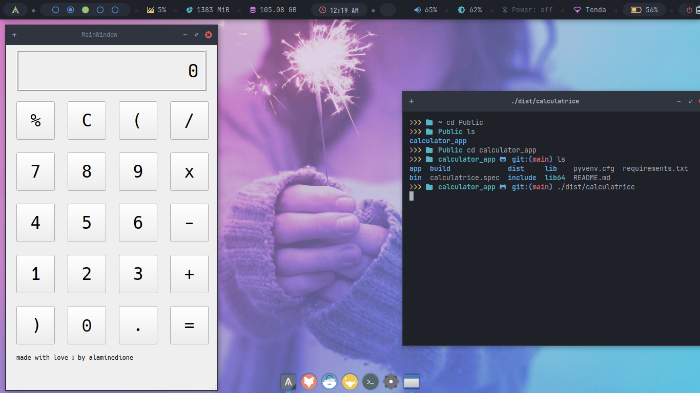

# Calculatrice

---

A simple calculator made with python and pyqt5.

---

# How to build an executable file

## create virtual environment

```bash
python3 -m venv venv
```

activate the virtual environment

```bash
source venv/bin/activate
```

## Installation

Ensure you are in the project directory and have python and pip installed.
install the requirements

```bash
pip install -r requirements.txt
```

## build

```bash
pyinstaller ./app/calculator.py --onefile
```

## Usage

double click on the executable file
or execute the following command:

```bash
./dist/calculator
```

note: you may have to give the executable file execution permission
the extension of the executable file is .exe on windows or .app on mac

## Screenshot



## License

MIT

## Author

[Alamine Dione](https://github.com/alaminedione)
hope you like it 😊
